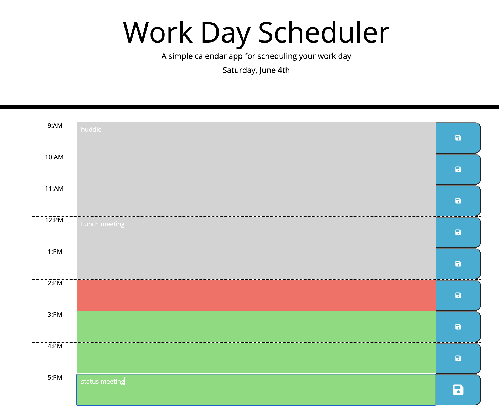

# Work Day Scheduler - JQuery

## user Story 

* Users should be able to add important events to a daily planner so that they can manage time effectively.

## Acceptance Criteria 

GIVEN user is using a daily planner to create a schedule
WHEN user opens the planner, THEN the current day is displayed at the top of the calender
WHEN user scrolls down, THEN user is presented with time blocks for standard business hours
WHEN user views the time block for the day, THEN each time block is color coded to indicate whether it is in the past, present or future (past - grey, present - ref, future - green)
WHEN user clicks into a time block, THEN user can enter an event 
WHEN user click the save button, THEN text for that event is saved in local storage
WHEN user refresh/reloads page THEN the saved events persists

## Mock-Up screens:

* Home Page - display the current events

* New event added

github URL: https://github.com/Sivaparam/Javascript-Quiz

Live URL: https://sivaparam.github.io/Javascript-Quiz/
